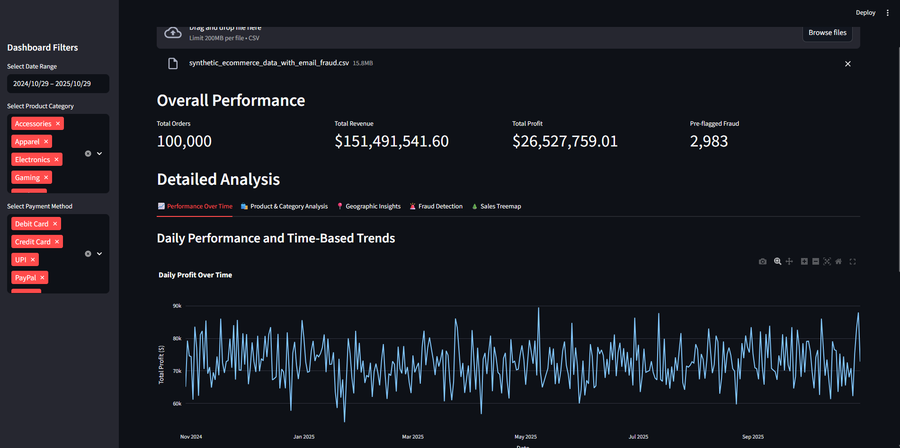

# Analytics Dashboard

An interactive web dashboard for analyzing e-commerce sales data, featuring synthetic data generation, advanced visualizations, and fraud detection. The entire application is containerized with Docker for easy, one-command setup and deployment on any machine.

<!-- A screenshot of your dashboard would look great here! -->
<!--  -->

---

## Features

-   **Synthetic Data Generation**: Creates a large CSV file (`100,000+` rows) with realistic e-commerce transactions, including fields for profit calculation and fraud indicators.
-   **Interactive Dashboard**: A multi-page web dashboard built with Streamlit and Plotly to explore the data.
-   **In-Depth Analysis**:
    -   **Performance Metrics**: Key indicators like total revenue, profit, and order count.
    -   **Time-Series Analysis**: Track daily profit and analyze sales trends by hour and day of the week.
    -   **Product Insights**: View top-selling products, popular categories, and a sales distribution treemap.
    -   **Geographic Visualization**: A choropleth map of the US showing sales, profit, or fraud by state.
    -   **Fraud Detection**: Anomaly detection scatter plot and a dedicated section to flag orders with suspicious email patterns (e.g., disposable domains).
-   **Containerized with Docker**: Packaged in a Docker container for consistent execution anywhere.

## Project Structure

```
.
├── dashboard.py                # The main Streamlit application
├── main.py                     # Script to generate synthetic sales data
├── requirements.txt            # Python dependencies
├── Dockerfile                   # Multi-stage Dockerfile for building the environment and app
└── tests/
    ├── test_logic.py           # Unit tests for backend functions
    └── test_ui.py          # UI/smoke tests for the Streamlit app
```

---

## 🚀 Getting Started with Docker (Recommended)

This project is designed to be run with Docker, which handles all dependencies and configuration for you. The `Dockerfile` uses a multi-stage build to create a reusable Python environment.

### Prerequisites

-   **Docker Desktop** installed and running on your machine.

### Step 1: Build the Docker Images

This project uses a multi-stage Docker build. We will first build a `base` image containing the Python environment, and then the final `app` image.

1.  **Build the Base Environment Image**
    This command builds the `base` stage and tags it as `python-env`. This image contains all the necessary Python packages.
    ```
    docker build --target base -t python-env:latest .
    ```

2.  **Build the Final Application Image**
    This command builds the final application image, which will be used to run the dashboard.
    ```
    docker build -t ecommerce-dashboard:latest .
    ```

### Step 2: Run Project Tasks Using Docker

Now that you have your images, you can easily run any part of the project.

#### A. Generate the Synthetic Data

This command runs the data generator inside a temporary container and saves the output CSV file to your project directory.
```
# On macOS/Linux
docker run --rm -v "$(pwd):/app" python-env:latest python main.py

# On Windows (Command Prompt)
docker run --rm -v "%cd%:/app" python-env:latest python main.py
```
This will create the `synthetic_ecommerce_data.csv` file in your project folder.

#### B. Run the Unit Tests

Execute the test suite using the `python-env` base image.
```
# On macOS/Linux
docker run --rm -v "$(pwd):/app" python-env:latest pytest

# On Windows (Command Prompt)
docker run --rm -v "%cd%:/app" python-env:latest pytest
```

#### C. Run the Dashboard

Finally, start the Streamlit dashboard.
```
docker run -d -p 8501:8501 --name my-dashboard ecommerce-dashboard:latest
```

### Step 3: Access the Dashboard

Open your web browser and navigate to:
[**http://localhost:8501**](http://localhost:8501)

---

## Local Setup (Without Docker)

If you prefer to run the application directly on your machine:

1.  **Create and Activate a Virtual Environment**.
2.  **Install Dependencies**: `pip install -r requirements.txt`.
3.  **Generate Data**: `python ecommerce_data_generator.py`.
4.  **Run Tests**: `pytest`.
5.  **Run the App**: `streamlit run dashboard.py`.
```
